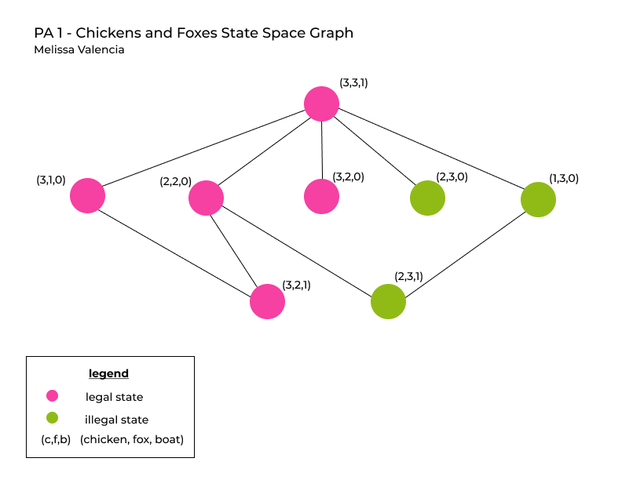

# PA 1 - Chicken and Foxes
# CS 76 AI, Fall 2021
## Melissa Valencia
# The Model: States and Actions

The model above of part of the graph of states allows us to see the actions to and from this initial state. Before determining the legality of states, an upper bound on the number of states must be given. This upper bound does not take into consideration the legality of states but rather provides all possible states. For this problem, the upper bound would be `(c+1) * (f+1) * b` where c denotes the total number of chickens and + 1 since there can be 0...n chickens; f denotes the total number of foxes and + 1 since there can be 0...n foxes; and b denotes the number of reachable boat locations which would be 2 since it is either 0 or 1 depending on the side. If applied to the start state (3,3,1), this means the upper bound would be `4*4*2` which is `32`. In order to determine the legality of states we must consider the given constraints. That is, there must not be more foxes than chickens on either side of the river and at maximum 2 animals can cross the river, ensuring that there is always an animal on the boat to cross back.
# Overall Design
`uniformed_search.py` contains the search algorithms used breadth-first search, path-checking depth-first search, and iterative deepening search respectively. `SearchSolution.py` outlines the necessary data for the valid solutions returned from any of the search algorithms. `FoxProblem.py` represents key information about the problem, including the start state, a get successors method stating the possible moves and checking the validity of states, and a goal test. `foxes.py` is where each search algorithm is tested.
# Breadth First Search
## Implementation
In order to solve this problem, this implementation of breadth-first search followed a graph-searching approach. The data structures used were a set to keep track of the visited states and a deque used for a first in, first out queue for the nodes to be visited. While the queue is not empty, keep track of the current node using popleft() 
and check if this node's state is the goal state. If we have found our goal state, we backchain through this node to get the path from the start state to the goal state and break. Until we find our goal state, we iterate through our current node's state's successors and check if this successor has been visited or not. If not, we add it to our visited set, and append this node and its state to the queue to be visited.
## Data Structures
The two data structures used were a set and a deque. A set was used to keep track of the visited nodes. A deque was used for the first in, first out implementation for the queue of nodes to be visited. 
## Runtime
This graph-searching implementation of breadth-first search stores the visited nodes in a set, making the exploration to a goal state much quicker, as there is limited redundancy. The runtime for this BFS implementation is O(b^d).
## Test Cases
To test this breadth first search algorithm, I tested the given (chicken,fox,boat) combinations in `foxes.py`. 
# Path-Checking Depth First Search
## Implementation
The implementation of path-checking depth-first search on this problem followed a recursive approach. It only keeps track of the states on the current path being explored and ensures that they are not visited again. There are no explicit data structures used in this implementation as we are recursively calling our `dfs_search` on every unvisited node and its successors, not keeping track of visited states but rather only keeping track of the states on the current path. We first add the node to be visited to our solution path then check if this node's state is the goal state. If it is not the goal state, we go through this node's successors, look for them in the solution path, and if not in the path, we call `dfs_search` recursively on this successor until we find the goal state within a solution path returned. We must make sure to remove the node if no solution is found on the current path in order to avoid looping through the same path. 
## Runtime
The runtime of this path-checking depth-first search algorithm is dependent on the branching factor and the maximum depth level. Thus its runtime is O(b^m). 
## Test Cases
To test this path-checking depth-first search algorithm, I tested the given (chicken,fox,boat) combinations in `foxes.py`. 
## Discussion Points
Path-checking depth-first search should save memory with respect to breadth-first search, as its memory is measured by `m`, representing the maximum depth whereas BFS is measured by `b^d` representing b, the maximum branching factor, and d, the depth of the shallowest solution which is greater than `m`. However, there are cases where Path Checking DFS would take much longer than BFS to reach a goal state. In the example below, path-checking starts at the left-most side of the graph and goes through the current path's states looking for the goal before discarding that path.

The path-checking depth-first search would take longer on this graph as it would go through most paths on the left most side before reaching the goal state, since it is only keeping track of states on this particular path. Breadth-first search would be much quicker because it would check all of the start state's successors and see that the goal is within the depth of 1. In this case, path-checking depth-first search would visit more nodes to find the goal state than breadth-first search would, thus path-checking depth-first search does not always save significant memory with respect to breadth-first search, as DFS returns the left-most solution.

Memoizing DFS would not save significant memory with respect to breadth-first search because memoizing DFS's memory measured by `b^m` where b is the maximum branching factor and m is the maximum depth which may be greater than the memory BFS's memory which is `b^d` representing b, the maximum branching factor, and d, the depth of the shallowest solution. Memoizing DFS would allocate memory for the entire graph, where as BFS would allocate memory up to the depth of the first solution it finds. 
# Iterative Deepening Search
## Implementation
To implement an iterative-deepening search method, the implementation of the `dfs_search` is used. Iterative-deepening allows us to limit the depth of the depth-first search by passing the current depth to each recursive call of `dfs_search` until we find a path or have reached the maximum depth. Since we are using our previous implementation of path-checking depth-first search within this iterative deepening search, no data structures are used to keep track of visited states as we only keep track of the states on the current path.
## Runtime
Iterative deepening has a runtime similar to BFS. It is iterating bsed on depth level, and thus its runtime is O(b^d).
## Test Cases
To test this iterative deepening search algorithm, I tested the given (chicken,fox,boat) combinations in `foxes.py`. 
## Discussion Points
Memoizing DFS would be preferable over path-checking DFS for this iterative deepening search since the point of iterative deepening is to iterate and explore by depth and not by entire paths such as path-checking does. Although in respect to memory, path-checking DFS saves memory by not storing the visited states, this approach would take a significantly longer run time to find a solution than memoizing DFS would since memoizing would ensure nodes are not visited more than once. However, in the end, BFS is still the most preferred search algorithm to use compared to both memoizing DFS and path-checking DFS, since it would take less memory and less time than the iterative depth approach.
# Lossy Chickens and Foxes
Given the lossy chickens and foxes context, the state for this problem would need to additionally include a variable representing E, which is the maximum number of chickens that could be eaten. In order to implement a solution to this new constraint, my code would have to account for a change in the validity of states that is my valid state cases would be altered to account for chickens being eaten. The upper bound on the number of possible states for this problem would be `(c+1) * (f+1) * b * (e+1)` where c represents the total number of chickens and + 1 since there can be 0...n chickens, f represents the total number of foxes + 1 and + 1 since there can be 0...n foxes, b represents the number of reachable boat locations which is 2, and e represents the maximum number of chickens that can b eaten and + 1 since it can be 0...n chickens eaten.