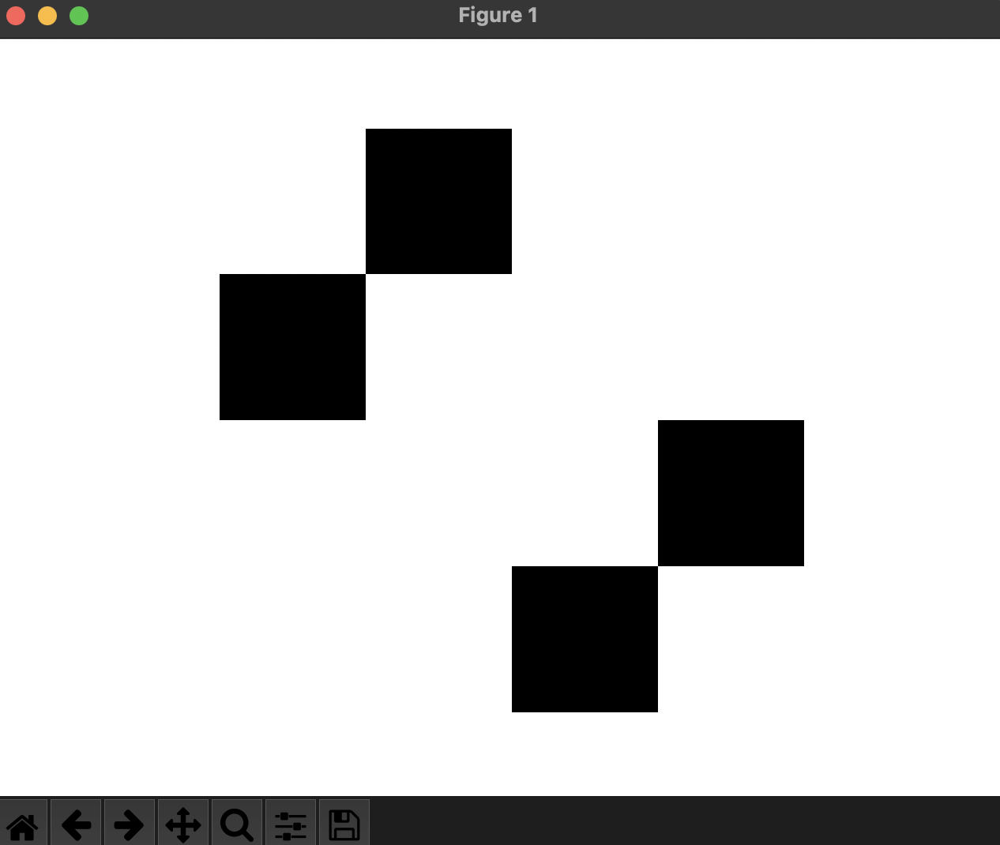
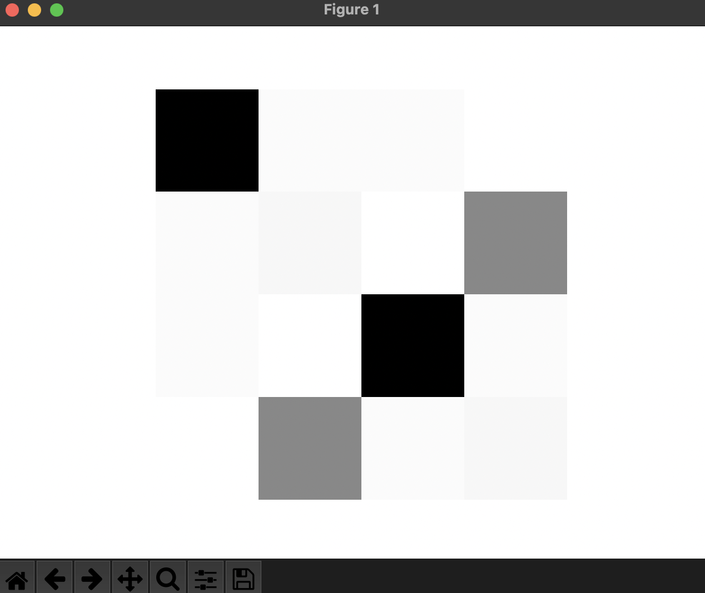
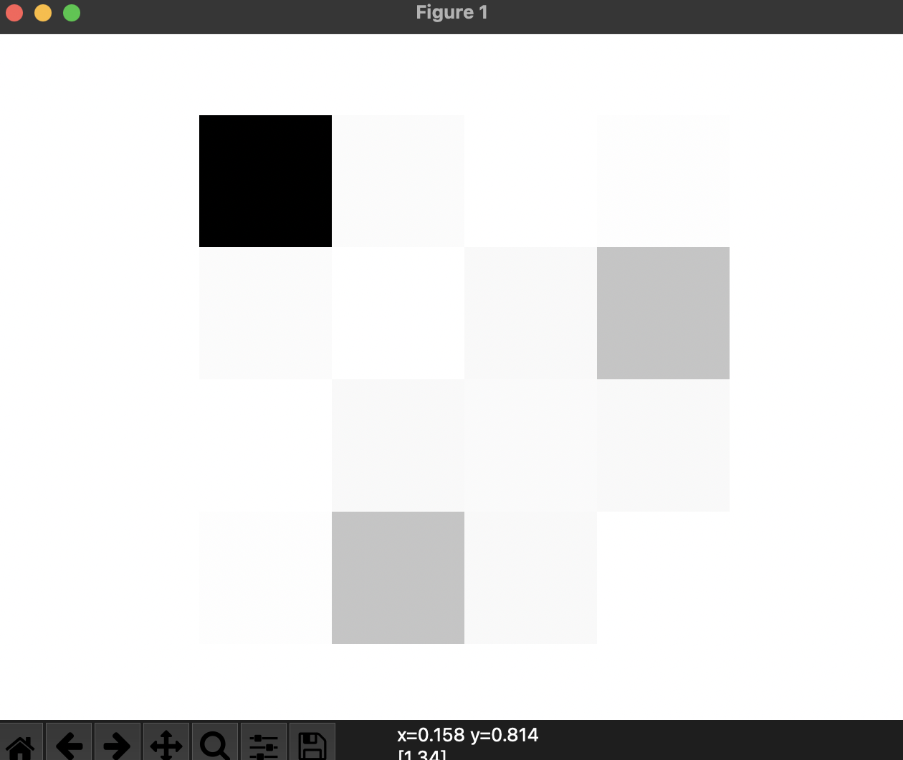

# PA 6 - Hidden Markov Models
# CS 76 AI, Fall 2021
## Melissa Valencia
# Description
`Maze.py` represents a maze object inputted in the format of colors: `r` (red), `g` (green), `b` (blue), `y` (yellow), instead of `.`. In order to accomodate for the change of input from `.` to these color letters, `is_floor` has been changed to check if the given location is one of the color letters and `what_color` has been added to return the color at a given coordinate. `Robot.py` represents a robot object given a maze. It keeps track of each color's probability matrix for the robot in a dictionary, `color_dict`, which probabilities are set by `set_color_dict` based on the given maze. It also contains the function necessary for generating evidence and the robot's path, `generate_path`, which loops through the given number of steps and gets the robot's possible positions, using `get_successors`, based on the current state to then create a valid path, all while accounting for 0.88 accuracy on colors that have been observed. `get_successors` returns the robot's possible positions based on the given state's coordinates, using `is_floor` to check the position's validity on the maze. `get_transition` returns the transition matrix necessary for the filtering algorithm, `filtering` in `HiddenMarkovModel.py`. This function loops through the maze and successors to calculate the probabilities of the robot moving from each position in the transition matrix. `prior` returns the starting matrix, with uniform probability, in which the robot has yet to make a move. `HiddenMarkovModel.py` contains the filtering algorithm following the description of the AIMA textbook. `filtering` initializes a list for the probabilities and sets the state to uniform probability, using `prior`. Then, looping through each color in the evidence, it find that color's matrix in `color_dict`, updates the state using matrix multiplication, normalizes this updated state, and adds the new probability distribution to the probabilities list.
# Evaluation
`Main.py` contains testing utilizing `Maze.py`, `Robot.py`, and `HiddenMarkovModel.py`. A maze object is initialized using `Maze.py` and ant of the maze files, such as `maze1.maz`. Then, a robot object is initialized using the maze object and `Robot.py`. `generate_path` is then called with a given number of steps and starting coordinate to generate evidence of observed colors and a path of the robot's positions. Finally, the `filtering` is called on the generated evidence and on the robot object producing a list of probability distribution matrices. The maze, the robot's path, and the probability distribution matrices are outputted, along with heatmap figures showing the maze positions where the robot will most likely be at, based on the given evidence.
## Main.py Ouput
Here is the output from `Main.py`, using `maze1.maz`.
```py
The maze:
byrg
yrgb
rgby
gbyr

The Robot's path:
[(1, 1), (1, 0), (2, 0)]
The probabilities at each step:
[[ 1. 22.  1.  1.]
 [22.  1.  1.  1.]
 [ 1.  1.  1. 22.]
 [ 1.  1. 22.  1.]]
[[29.92312241  0.73920757  0.73920757  0.11827321]
 [ 0.73920757  1.36014193  0.11827321 16.26256653]
 [ 0.73920757  0.11827321 29.92312241  0.73920757]
 [ 0.11827321 16.26256653  0.73920757  1.36014193]]
[[55.11559926  1.33839055  0.07006016  0.70422535]
 [ 1.33839055  0.07006016  1.97255575 15.49295775]
 [ 0.07006016  1.97255575  1.54132341  1.97255575]
 [ 0.70422535 15.49295775  1.97255575  0.17152659]]
```





